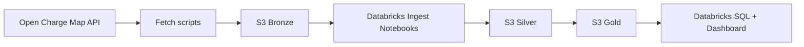

# EV Charging Analytics Pipeline

End-to-end data pipeline for EV charging infrastructure analytics.

This project ingests Open Charge Map data, lands raw snapshots in AWS S3, transforms data in Databricks with PySpark and Delta Lake, and publishes analytics-ready gold tables for dashboards and SQL reporting.

## Project Highlights

- Infrastructure as code for AWS and Databricks with Terraform.
- Open Charge Map ingestion from two endpoints:
  - `/v3/poi` for charging station records.
  - `/v3/referencedata/` for operators, connector types, usage types, countries, and status dimensions.
- Medallion architecture on S3:
  - Bronze: raw JSON snapshots.
  - Silver: cleaned and enriched Delta tables.
  - Gold: aggregate Delta tables for analytics.
- Databricks notebook pipeline with orchestration.
- SQL analytics queries created through Terraform for Databricks SQL.

## Architecture Overview

Storage and compute are intentionally separated:

- AWS S3 stores raw and processed data.
- Databricks on AWS provides Spark compute, jobs, notebooks, and SQL warehouse.
- Terraform provisions both AWS resources and Databricks resources.

```text
Open Charge Map API
      |
      v
Local fetch scripts
      |
      v
S3 bronze (raw JSON, partitioned by date)
      |
      v
Databricks notebooks (02 -> 03 -> 04)
      |
      +--> S3 silver Delta (stations, connections)
      |
      +--> S3 gold Delta (KPI and aggregate tables)
      |
      v
Databricks SQL queries + dashboard notebook
```

## Architecture Diagram (Add Your Final Diagram Here)

Use this placeholder section to add your own final architecture diagram before publishing.



## Data Model

### Bronze

- Path pattern: `s3://<bucket>/bronze/openchargemap/date=YYYY-MM-DD/*.json`
- Content:
  - POI snapshots (`openchargemap_poi*.json`)
  - Reference snapshots (`openchargemap_reference*.json`)

### Silver

- Base path: `s3://<bucket>/silver/openchargemap/`
- Tables:
  - `stations`: one row per charging location.
  - `connections`: one row per connector record.
- Enrichment:
  - Lookup labels are applied when reference snapshots are available.

### Gold

- Base path: `s3://<bucket>/gold/openchargemap/`
- Tables:
  - `kpi_summary`
  - `stations_by_region`
  - `connectors_by_type`
  - `stations_by_operator` (reference-enabled)
  - `stations_by_usage_type` (reference-enabled)
  - `operator_connector_summary` (reference-enabled)

## Prerequisites

- Python 3.9+
- Terraform 1.6+
- AWS account with permissions for:
  - S3 bucket and object operations
  - IAM role, policy, and instance profile creation
- Databricks workspace on AWS with:
  - Personal access token
  - Permission to create cluster, notebook, job, SQL warehouse, and SQL queries

## Quick Start (Linux)

### 1) Create Python environment and install dependencies

```bash
python3 -m venv .venv
source .venv/bin/activate
python -m pip install --upgrade pip
pip install -r requirements.txt
```

### 2) Configure environment variables

```bash
cp .env.example .env
# edit .env with your real values
```

Required values in `.env`:

- `OCM_API_KEY`
- `AWS_ACCESS_KEY_ID`
- `AWS_SECRET_ACCESS_KEY`
- `AWS_REGION`
- `EV_PIPELINE_S3_BUCKET`
- `DATABRICKS_HOST`
- `DATABRICKS_TOKEN`

Load `.env` into your shell session:

```bash
set -a
source .env
set +a
```

### 3) Provision AWS resources (S3 + IAM)

```bash
cd terraform/aws
cp terraform.tfvars.example terraform.tfvars
# edit terraform.tfvars (bucket_name, region, environment)
terraform init
terraform plan
terraform apply
cd ../..
```

Save the output value `databricks_instance_profile_arn` for the Databricks Terraform step.

### 4) Fetch raw Open Charge Map data

```bash
python scripts/fetch_openchargemap.py --country-code FI --max-results 300
python scripts/fetch_openchargemap.py --reference-only
```

### 5) Upload raw data to S3 Bronze

```bash
python scripts/upload_sample_data.py --date DATE --all
```

### 6) Provision Databricks resources

```bash
cd terraform/databricks
cp terraform.tfvars.example terraform.tfvars
# edit terraform.tfvars:
# - aws_instance_profile_arn
# - pipeline_bucket_name
# - pipeline_partition_date (YYYY-MM-DD or auto)
terraform init
terraform plan
terraform apply
cd ../..
```

### 7) Run pipeline and analytics

- In Databricks Jobs, run `ev-charging-openchargemap-pipeline`
- Or run notebooks manually using `01_ingest_orchestrator.py` as the entry point
- Open `05_analytics_dashboard.py` for visual exploration
- Open Databricks SQL to run generated analytics queries

## Notebook Workflow

### 01_ingest_orchestrator.py

- Defines widgets (`bucket_name`, `partition_date`)
- Resolves `partition_date` to today if empty or `auto`
- Executes 02, 03, and 04 notebooks in sequence

### 02_read_bronze.py

- Reads POI JSON and reference JSON from Bronze
- Creates `raw_df` and lookup DataFrames for enrichment

### 03_build_silver.py

- Builds `stations_df` and `connections_df`
- Applies optional lookup enrichment
- Writes Delta Silver tables

### 04_build_gold.py

- Reads Silver tables
- Builds aggregate Gold tables
- Writes Delta Gold tables

### 05_analytics_dashboard.py

- Loads Silver and Gold outputs
- Displays KPI, regional distribution, connector mix, operator footprint, usage type, and map views

## SQL Analytics Layer

Terraform creates Databricks SQL queries from the SQL files in the `sql/` folder:

- `gold_kpi.sql`
- `stations_by_region.sql`
- `connectors_by_type.sql`
- `stations_by_operator.sql`
- `stations_by_usage_type.sql`
- `operator_connector_summary.sql`

Each query reads Delta data from S3 using the configured bucket variable.

## Operational Notes

- Pipeline writes are currently overwrite mode.
- `pipeline_partition_date = "auto"` supports scheduled daily ingestion without changing Terraform variables.
- Reference-dependent Gold tables are skipped when reference snapshots are not available.
- Keep `terraform.tfvars` and `.env` local only.

## Troubleshooting

- Error: missing AWS credentials
  - Make sure `.env` is loaded with `set -a; source .env; set +a`
- Databricks cluster cannot read S3
  - Confirm `aws_instance_profile_arn` is valid and attached to the cluster
- Gold reference tables are missing
  - Ensure you ran `fetch_openchargemap.py --reference-only` and uploaded files with `--all`

## Security and Publish Checklist

Before pushing to GitHub:

- Do not commit `.env`, `terraform.tfvars`, Terraform state files, or raw JSON snapshots
- Rotate credentials immediately if they were ever committed
- Keep `.env.example` and `terraform.tfvars.example` as templates only
- Add a `LICENSE` file
