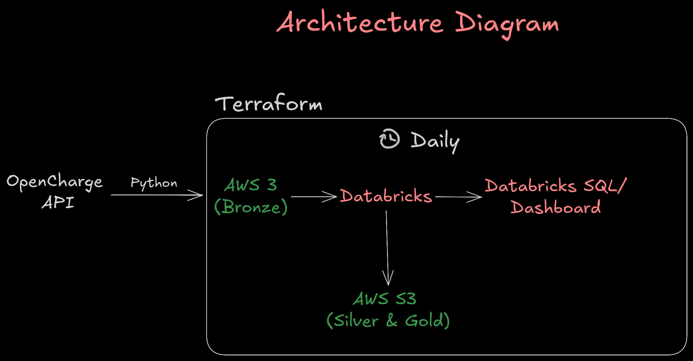

# EV Charging Analytics Pipeline

End-to-end data pipeline for EV charging infrastructure analytics.

This project ingests Open Charge Map data, lands raw snapshots in AWS S3, transforms data in Databricks with PySpark and Delta Lake, and publishes analytics-ready tables for dashboards and SQL reporting.

## Description

The pipeline processes two Open Charge Map endpoints:

- `/v3/poi` for charging station records
- `/v3/referencedata/` for lookup dimensions (operators, connector types, usage types, countries, status types)

Data is organized with a Medallion architecture:

- Bronze: raw JSON snapshots
- Silver: cleaned and enriched Delta tables
- Gold: aggregate Delta tables for analytics

## Project Highlights

- Automated infrastructure provisioning with Terraform (AWS + Databricks)
- Reliable notebook orchestration for Bronze to Silver to Gold processing
- Reference-data enrichment for better analytics quality
- SQL analytics layer managed as code through Terraform
- Reproducible pipeline runs with configurable partition date

## High Level Architecture




- Terraform provisions AWS resources and Databricks resources
- Python scripts fetch Open Charge Map data and upload raw files
- S3 stores Bronze raw JSON and Delta outputs for Silver and Gold
- Databricks notebooks transform and enrich the data model
- Databricks SQL queries and dashboard notebook provide analytics consumption

## Data Layers

### Bronze

- Raw Open Charge Map snapshots in S3
- Partitioned by ingestion date

### Silver

- `stations` and `connections` Delta tables
- Optional enrichment from reference snapshots

### Gold

- Aggregate Delta tables for reporting:
  - `kpi_summary`
  - `stations_by_region`
  - `connectors_by_type`
  - `stations_by_operator` (reference-enabled)
  - `stations_by_usage_type` (reference-enabled)
  - `operator_connector_summary` (reference-enabled)

## Requirements

- Python 3.9+
- Terraform 1.6+
- AWS account with S3 and IAM permissions
- Databricks workspace on AWS
- Open Charge Map API key

## Setup and Run (Linux)

### 1. Create Python environment

```bash
python3 -m venv .venv
source .venv/bin/activate
python -m pip install --upgrade pip
pip install -r requirements.txt
```

### 2. Configure environment variables

```bash
cp .env.example .env
# edit .env with your values
set -a
source .env
set +a
```

Required keys:

- `OCM_API_KEY`
- `AWS_ACCESS_KEY_ID`
- `AWS_SECRET_ACCESS_KEY`
- `AWS_REGION`
- `EV_PIPELINE_S3_BUCKET`
- `DATABRICKS_HOST`
- `DATABRICKS_TOKEN`

### 3. Provision AWS layer

```bash
cd terraform/aws
cp terraform.tfvars.example terraform.tfvars
# edit terraform.tfvars
terraform init
terraform apply
cd ../..
```

### 4. Fetch and upload raw data

```bash
python scripts/fetch_openchargemap.py --country-code FI --max-results 300
python scripts/fetch_openchargemap.py --reference-only
python scripts/upload_sample_data.py --date DATE --all
```

### 5. Provision Databricks layer

```bash
cd terraform/databricks
cp terraform.tfvars.example terraform.tfvars
# edit terraform.tfvars (instance profile ARN, bucket name, partition date)
terraform init
terraform apply
cd ../..
```

### 6. Execute pipeline

- Run Databricks job `ev-charging-openchargemap-pipeline`
- Or run notebooks manually starting from `01_ingest_orchestrator.py`
- Open `05_analytics_dashboard.py` for exploration

## Configuration

- Use `.env.example` as the template for runtime secrets
- Use `terraform.tfvars.example` in each Terraform folder as the template for IaC variables
- Keep `.env`, `terraform.tfvars`, and Terraform state files out of source control

## Troubleshooting

- Missing AWS credentials
  - Reload `.env` in your shell: `set -a; source .env; set +a`
- Databricks cluster cannot read S3
  - Verify instance profile ARN and IAM permissions
- Missing reference-based Gold tables
  - Ensure reference snapshots were fetched and uploaded
- Terraform authentication issues
  - Verify AWS credentials and Databricks token are active

## Security Checklist

- Do not commit `.env`, `terraform.tfvars`, or Terraform state files
- Rotate keys immediately if credentials were exposed
- Keep sample/template config files only in Git
